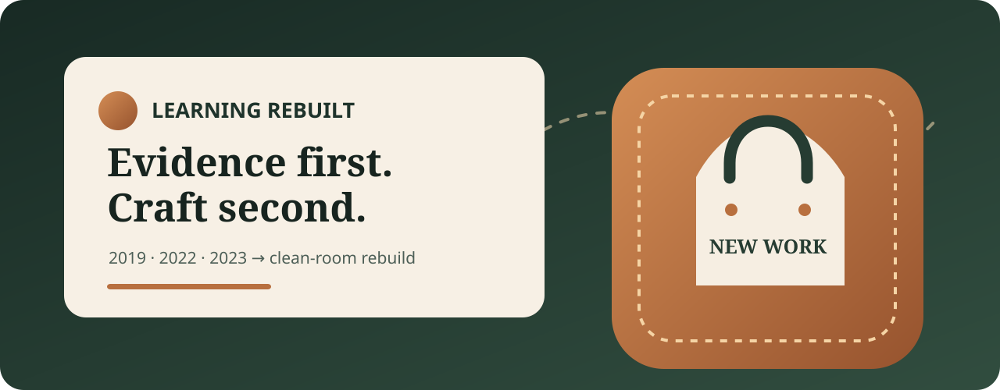

# Leathercraft Commerce — Learning Rebuilt



An evidence-bounded case study and clean-room reconstruction of a multi-year web-learning journey. It pairs an honest critique of three historical project phases with a new, accessible React commerce demonstration.

[View the live case study](https://saliflearning.github.io/leathercraft-commerce-rebuild/) · [Inspect the quality workflow](https://github.com/Saliflearning/leathercraft-commerce-rebuild/actions/workflows/quality.yml)

> This is not the original academic application or a live store. The catalog is fictional, the cart stays in the browser, and there is no account, checkout, payment, order, analytics, or personal-data collection.

## What this demonstrates

- Product thinking: turns scattered iterations into a clear problem, scope, and learning narrative.
- Front-end engineering: typed React components, search, category filtering, product details, and local cart state.
- Engineering discipline: test-first logic and component work, real-browser journeys, accessibility checks, exact-pinned dependencies, and CI.
- Security judgment: validates untrusted local storage, excludes legacy credentials and data, and avoids inventing a transactional backend.
- Professional integrity: distinguishes verified team history, qualified evidence, newly authored work, and explicit non-claims.

## The learning journey

| Phase | Scope                            | What existed                                                                      | Honest assessment                                                                                                                                                                                                                                                   |
| ----- | -------------------------------- | --------------------------------------------------------------------------------- | ------------------------------------------------------------------------------------------------------------------------------------------------------------------------------------------------------------------------------------------------------------------- |
| 2019  | Individual static concept        | Multi-page HTML/CSS storefront exploration                                        | Useful visual practice, but not a commerce system; the exact graded-submission mapping remains unresolved.                                                                                                                                                          |
| 2022  | Team course implementation       | PHP/MySQL search, CRUD, authentication, protected cart, and admin controls        | Broad feature coverage, but raw queries, legacy password hashing, missing input/CSRF protections, weak documentation, and unclear asset rights made it unfit for publication or production. My defensible role is assigned coding lead/contributor—not sole author. |
| 2023  | Individual HCI/commerce redesign | Requirements, information architecture, prototype, and platform redesign evidence | Better design process, but no complete final source repository or verified current deployment.                                                                                                                                                                      |

The old application code is intentionally absent. Publishing it would expose private course material, rights-unclear assets, unsafe patterns, and attribution ambiguity. This repository preserves the learning value without laundering old work into a stronger claim.

## The new reconstruction

The current application is new work built from a closed, fictional dataset. A visitor can:

1. scan the three-phase case study and technical retrospective;
2. search and filter eight fictional products across four categories;
3. inspect an accessible product dialog;
4. add, update, remove, and locally persist cart items within stock limits; and
5. inspect the source, decisions, tests, and release gates behind every material quality claim.

The architecture is deliberately static:

```text
typed fictional records
        │
        ├── evidence-led case study
        └── catalog discovery ── product dialog ── validated local cart
                                                        │
                                               no network or checkout
```

See [architecture](docs/architecture.md), [evidence and claims](docs/evidence-and-claims.md), [security](docs/security.md), and [accessibility](docs/accessibility.md) for the reasoning behind those boundaries.

Changes should follow the evidence and clean-room rules in [CONTRIBUTING.md](CONTRIBUTING.md).

## Run it locally

Prerequisites: Node.js 24 and npm 11.

```bash
npm ci
npx playwright install chromium
npm run dev
```

Open the URL printed by Vite. The application needs no environment variables, private files, account, paid service, or runtime API.

## Verify it

```bash
npm run verify
```

That single command checks formatting, lint, TypeScript, 21 unit/component tests, provenance fixtures, the production build, three Chromium journeys with axe, dependency vulnerabilities, credential-like content, tracked-file provenance, and built-output provenance.

## Repository map

- `src/app` — application composition and recruiter story.
- `src/components` — case-study, catalog, dialog, cart, and original illustrations.
- `src/data` — bounded historical statements and fictional products.
- `src/lib` — catalog and cart validation logic.
- `tests/e2e` — browser, keyboard, responsive, reduced-motion, and accessibility journeys.
- `scripts` — deterministic secret and publication-boundary checks.
- `docs` — architecture, evidence, security, accessibility, decisions, and verification record.
- `specs` — requirements, research, model, contracts, plan, and implementation tasks.

## Deliberate limitations

- This is a front-end demonstration, not production commerce software.
- Prices and stock are fixed sample values; local cart state is not authoritative.
- No backend, identity, authorization, inventory service, payment, fulfillment, telemetry, or content-management system exists.
- Historical claims summarize reviewed private evidence; the evidence itself is not redistributed.
- Automated accessibility checks reduce risk but do not replace testing with people who use assistive technology.

## License and historical boundary

New source code, prose, and original vector compositions in this repository are available under the [MIT License](LICENSE). That license does not cover private historical artifacts, course materials, third-party assets, business data, or legacy source files; none are included here.
